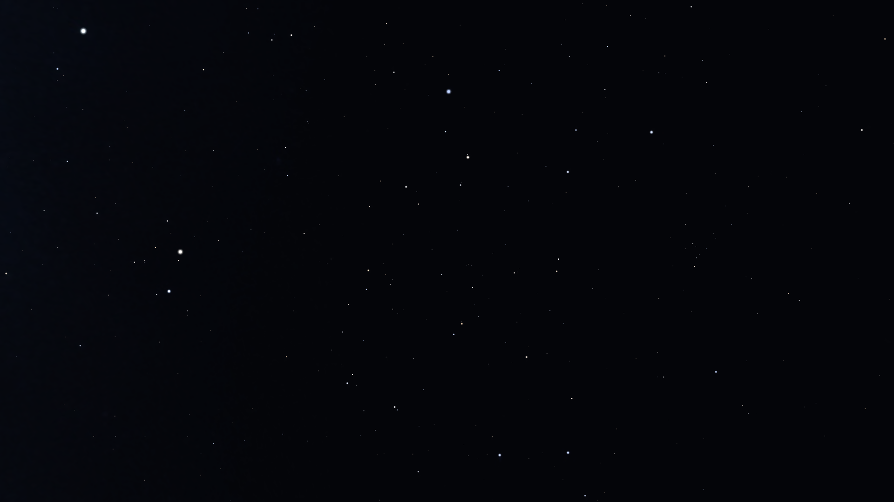
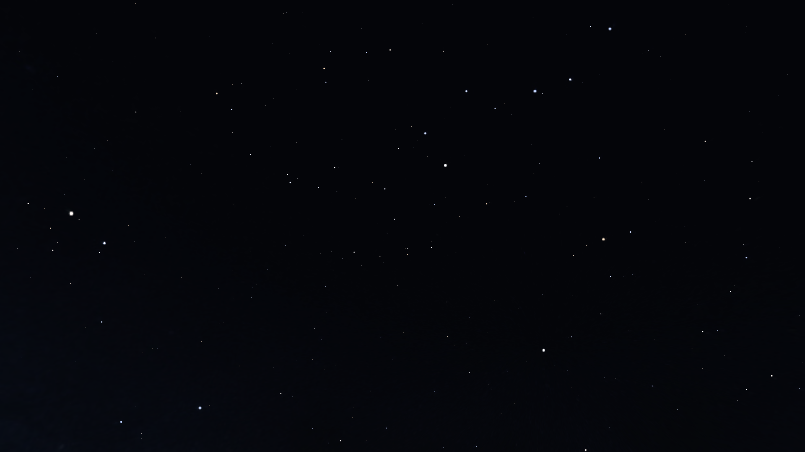
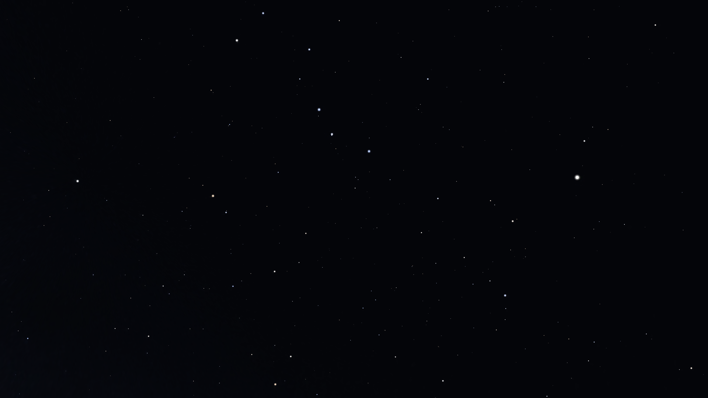
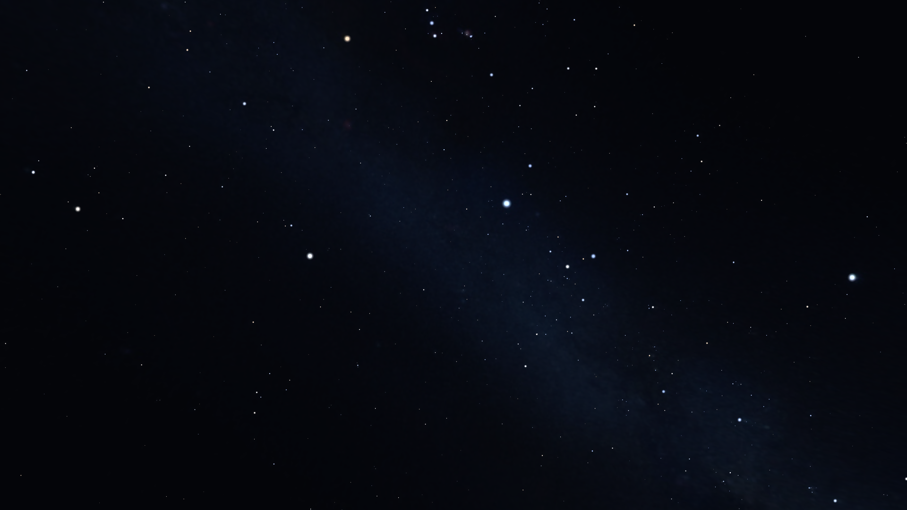
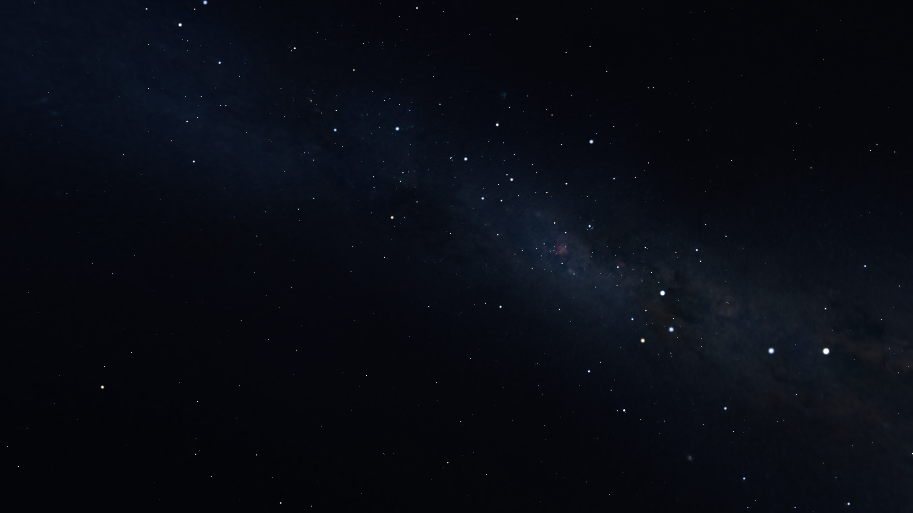

# SoC Star Modelling
## Introduction
The aim of our project is to make a model which given an image of the night sky, identifies the constellations present in it. We use a CNN-classifier for this purpose and generate the required dataset using the Stellarium API.
## Procedure
### Generating Data
We made a [stellarium script](./generation_tools/bear-tracker.ssc) which takes snapshots of random images of the night sky.
The script points to a random attitude, and takes a screenshot of the sky. The fractions of stars visible in each constellation is calculated using the _coordinates of the stars, attitude of view and FOV, aspect ratio of image_. Most of the atmospheric and astronomic effects (atmosphere, twinkling, meteors, planets, zodiacal light) are excluded, while some (milky way, magnitude limit) are left enabled. The images are originally 1920x1080, but we trained the CNN using scaled-down 256x144 images. Using this script, we made 10000 training and 1000 testing images: [data](https://drive.google.com/file/d/1ht-Py8yWtqoB3QZBt6jJJEHNFQDh-75X/view) 
| Property | Value |
| --- | --- |
| FOV | 60d |
| Mag Limit | 6 |
| Aspect Ratio | 16:9 |
| Projection | Perspective |
### Using CNN VGG16
Now, after we have the dataset, we made a model which given the image tells how much percentage of each constellation belongs to the image. This appears as a classification problem. For this we did something similar to the VGG-16 classifier. But we wanted to keep images of different size(i.e. 256\*144) instead of 224*224(as used in the original paper of VGG-16 classifier) hence we made some changes in the structure to suit our needs. Also, classifying stars is not the same as classifying objects since essentially stars are discrete and other commonly observed objects are continuous. Hence, to tackle that we felt that the size of the filter should be large since it should be of the order of inter-star distance in order to give meaningful results. So, taking in mind the trade-off between results and computational time, we decided to keep the filter size of 7 instead of 3 as in the original paper. Also, we added batch normalisation and dropout layers to the model which were not present in the original paper.
### Generated label properties
The ouput is an 88-length array, with each element representing the fraction of the specific constellation visible in the image.
## Samples
| Input | Expected Output |
| --- | --- |
| IMG | ORI GEM CNC CMI CMA MON LEP SEX PYX TRI ARI LEO LMI LYN VIR VEL CEN CRT ANT HYA PUP COL CAR CAS PIC DOR AND TAU AUR HOR CAE SCL CET FOR PHE CAM ERI PEG PER PSC UMA UMI CEP CHA CIR COM CRA CRB CRU CRV CVN CYG DEL DRA EQU GRU HER HYI IND LAC LIB LUP LYR MEN MIC MUS NOR OCT OPH PAV PSA RET SCO SCT SER SGE SGR APS AQL AQR ARA VOL VUL BOO CAP TUC TRA TEL |
|  | 0 0 0 0 0 0 0 0 0 0 0 0 0 0 0.5384615384615384 0 0 0 0 0 0 0 0 0 0 0 0 0 0 0 0 0 0 0 0 0 0 0 0 0 0.3 0.14285714285714285 0 0 0 1 0 1 0 0 1 0 0 0.3333333333333333 0 0 0.36363636363636365 0 0 0 0.5 0 0 0 0 0 0 0 0.21052631578947367 0 0 0 0 0 0.5294117647058824 0 0 0 0 0 0 0 0 1 0 0 0 0 |
|  | 0 0.6470588235294118 1 1 0 0.3 0 1 0 0 0 1 1 0.5 0.38461538461538464 0 0 1 0 0.8125 0 0 0 0 0 0 0 0 0 0 0 0 0 0 0 0 0 0 0 0 0.15 0 0 0 0 0 0 0 0 0.4 0 0 0 0 0 0 0 0 0 0 0 0 0 0 0 0 0 0 0 0 0 0 0 0 0 0 0 0 0 0 0 0 0 0 0 0 0 0 |
|  | 0 0 0 0 0 0 0 0 0 0 0 0 0 0 0.38461538461538464 0 0 0 0 0.0625 0 0 0 0 0 0 0 0 0 0 0 0 0 0 0 0 0 0 0 0 0 0 0 0 0 0 1 0 0 0 0 0 0 0 0 0 0 0 0 0 1 0.5454545454545454 0 0 0 0 0.5 0 0.9473684210526315 0 0 0 1 1 0.8823529411764706 0 1 0 0.1 0 0.14285714285714285 0 0 0.07692307692307693 0 0 0 0.7142857142857143 |
|  | 0 0 0 0 0 0 0 0 0 0 0 0 0 0 0 0 0 0 0 0 0 0 0 0 0 0 0 0 0 0 0 0 0 0 0 0 0 0.3076923076923077 0 0.17647058823529413 0 0 0 0 0 0 1 0 0 0 0 0 1 0 1 0.1111111111111111 0 0 0.25 0 0 0 0 0 1 0 0 0 0.15789473684210525 0.25 0.4444444444444444 0 0.29411764705882354 1 0.058823529411764705 0 1 0 0.8 0.7391304347826086 0 0 0 0 1 0 0 1 |
|  | 0 0 0 0 0 0 0 0 0 0 0 0 0 0 0.8461538461538461 0 0.75 0 0 0.125 0 0 0 0 0 0 0 0 0 0 0 0 0 0 0 0 0 0 0 0 0 0 0 0 0 1 0 0.7142857142857143 0 0.6 0 0 0 0 0 0 0 0 0 0 1 1 0 0 0 0 0.75 0 0 0 0 0 0.35294117647058826 0 0.4117647058823529 0 0 0 0 0 0 0 0 0.6153846153846154 0 0 0 0 |
### Summary
We trained our classifier for 20 epochs on 10000 images. Still the results were not up to the mark. It seemed as if the classifier did not learn anything at all and due to the sparse dataset where all values were 0, it tend to give numbers almost equal to 0 in the output.